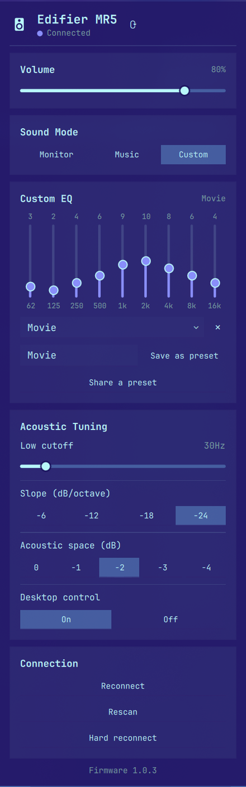

# Edifier MR5 — Omarchy shell plugin

Control an [Edifier MR5](https://edifier.com) studio monitor over Bluetooth LE
from your [Omarchy](https://omarchy.org) bar — volume, sound mode, and the
9-band custom EQ curve — without the phone app.

The protocol is unofficial, reverse-engineered from the Edifier ConneX
Android app. Not affiliated with or endorsed by Edifier.

> [!WARNING]
> **Tested on exactly one MR5.** Works well there; other units/firmware may
> differ. Other Edifier "box" products sharing the `lib_connect` protocol may
> work too (see [Compatibility](#compatibility)) but are untested.



## Features

- **Volume** — live slider, synced with the physical knob and the ConneX app
- **Sound Mode** — Monitor / Music / Custom, matching the speaker's LED colors
- **Custom EQ** — the speaker's 9-band graphic EQ (62 Hz–16 kHz), drag to adjust
- **Presets** — save/apply curves locally, plus a share-code to hand one to someone else
- **Acoustic Tuning** — low-cutoff filter, room compensation, desktop-control switch
- **Firmware version display** — informational only, see [Firmware updates](#firmware-updates)
- A persistent background daemon keeps the BLE connection open, so the panel opens instantly
- No settings screen — everything the speaker exposes is on one panel

## Requirements

- Omarchy running the Quickshell-based shell
- `python-bleak`: `sudo pacman -S python-bleak`
- `bluetoothd` (BlueZ) running

## Install

```sh
omarchy plugin add https://github.com/Devis99/omarchy-edifier-mr5.git --enable
```

First connection scans for a device advertising manufacturer ID `0x07E0`
(Edifier) or named "EDIFIER BLE"; the address is then cached in
`~/.config/edifier-mr5/config.json`. Put the speaker in pairing mode (button
on the back) for that first scan — no normal OS Bluetooth pairing needed.

## Usage

Click the speaker icon in the bar; `r` refreshes and `Esc` closes. Scroll the
wheel over the icon to change the speaker's volume without opening anything,
and middle-click it to refresh in place.

Drag any band in Custom mode to adjust the curve. Presets sit below the
sliders, and "Share a preset" expands the share-code exporter/importer.

The only setting is the status poll interval, in the shell's own plugin
settings (or as `refreshIntervalSec` in `~/.config/omarchy/shell.json`).

## Compatibility

Only confirmed on one MR5, but nothing in the code is unit-specific — GATT
UUIDs, command protocol, and EQ layout come from Edifier's product-level
catalog, and discovery matches by manufacturer ID/name, not a hardcoded
address. Other Edifier "box" speakers likely work with moderate changes
(mainly re-deriving the EQ band layout, see `scripts/edifier_protocol.py`).
Earbuds/headphones use a different protocol entirely and aren't covered.

## Known limitations

- **BLE reconnects can be flaky** — "Hard reconnect" in the Connection card
  power-cycles the Bluetooth adapter to fix it (briefly disrupts other BT
  devices).
- **Input source switching isn't implemented** — value mapping wasn't reliably pinned down.
- **Firmware updates are not flashable from here, by design** — see below.
- **No BLE pairing/bonding** (matches Edifier's own protocol) — a spoofed
  device advertising the same identifiers could in principle connect instead
  of your real speaker.

## Firmware updates

Shows your installed version only — does **not** flash firmware. The OTA
handshake was located in the decompiled app but not fully reverse-engineered,
and getting it wrong risks bricking the speaker with no confirmed recovery
path. Use the official ConneX app for firmware updates.

## How it works

Panel.qml (bar widget) → `Service.qml` (one long-lived Unix socket) →
`edifier_daemon.py` (holds the one BLE connection, auto-reconnects) →
`edifier_protocol.py` (packet framing + reverse-engineered command set).

The daemon exists because reconnecting fresh per-command was unreliable for
this speaker's BLE peripheral. `Service.qml` keeps a single socket open for
the session rather than forking a client per poll; `edifier_ctl.py` is the
CLI entry point and is what starts the daemon when it isn't running.

`python3 scripts/test_edifier.py` checks the guards on the write path.

## Uninstall

```sh
omarchy plugin remove devis99.edifier-mr5
pkill -f edifier_daemon.py   # the daemon isn't stopped by plugin remove
rm -rf ~/.config/edifier-mr5 ~/.cache/edifier-mr5   # optional: cached config/EQ profiles
```

## License

MIT — see [LICENSE](LICENSE).
